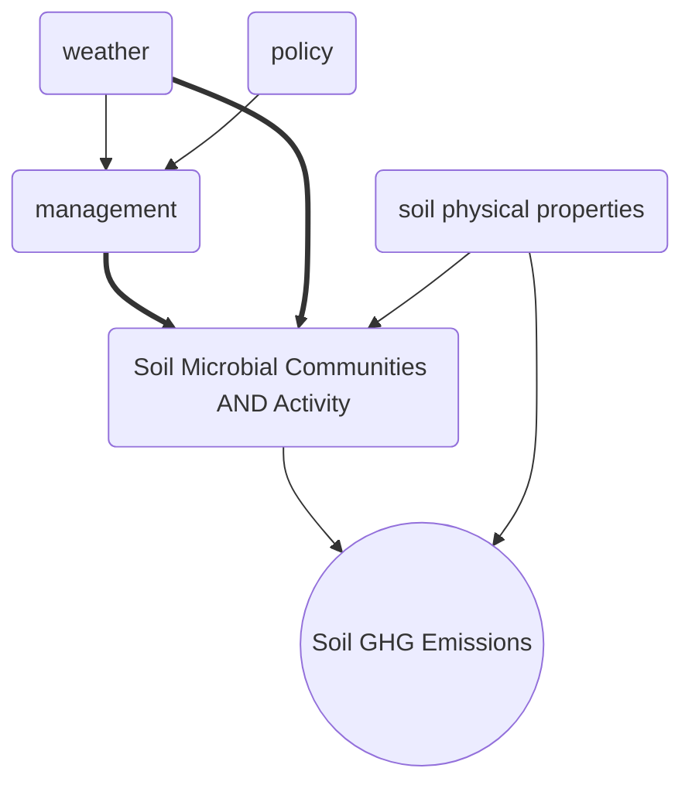

# Logic Tree

I'm working to figure out Typora.. 

```mermaid
graph TD
A(Soil Microbial Communities AND Activity)
B(weather)
C(management) 
D(soil physical properties)
E(policy)
F((Soil GHG Emissions))

C ==> A 
B ==> A 
D --> A
B --> C
E --> C
A --> F 
D --> F
 
```

# Heading 1 